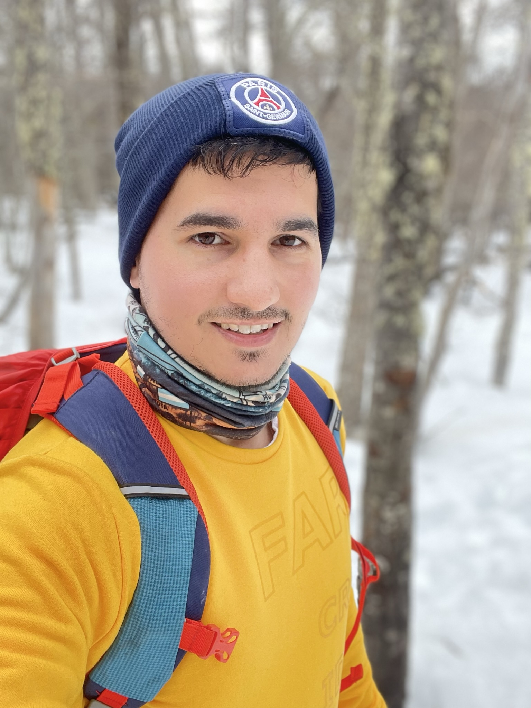

## Hello World 👋 It's Lucas Angelino
I'm a Full Stack developer, fan of web technologies. [React](https://reactjs.org). [AstroJs](https://astro.build/). [Svelte](https://svelte.dev/).
 
I love Hicking and Nature ❤
 

 

 

## Links
- 📃 ([Online Resume](https://lucasangelinocv.vercel.app/)

## What i'm up to

- 🔭 I’m currently working @ [JP Morgan & Chase](https://www.jpmorgan.com/AR/en/about-us).
- 🌱 I’m currently working in Awesome projects.
- 👯 Member of different Developer Communities.
- 💬 Creating content in [my blog](https://main--deluxe-praline-fda483.netlify.app/) (BETA - Not released yet),
   
 
<a href="https://github.com/reactjs/es.react.dev" target='_blank'>

  Contributing translating React Dev Docs to Spanish
</a>
 

<a href="/" target='_blank'>

  Contributing with Open Source Software
</a>
 

---

